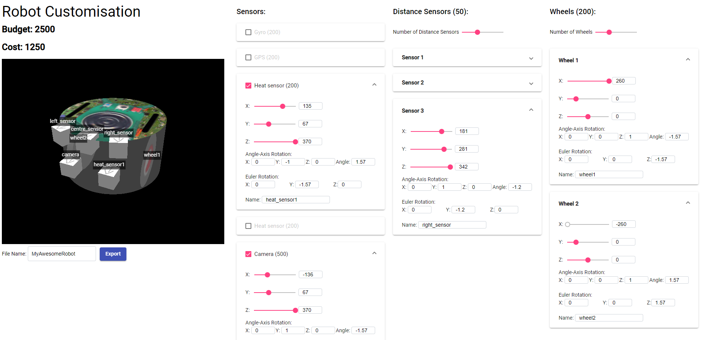

# Robot Customisation

Robot customiser and generator for RoboCupJunior 2021

## Features

### Components

All components can be positioned and rotated anywhere around the robot.  
They can also be given custom names so they can be easily accessed in your code.  

- GPS
- Gyro
- Heat Sensor (x2)
- Camera (x2)
- Colour Sensor
- Accelerometer
- Lidar Sensor
- Distance Sensors (up to 8)

## TODO

- [x] Add finalised Lidar properties  

---

This project was generated with [Angular CLI](https://github.com/angular/angular-cli) version 10.2.0.

## Development server

Run `ng serve` for a dev server. Navigate to `http://localhost:4200/`. The app will automatically reload if you change any of the source files.

## Code scaffolding

Run `ng generate component component-name` to generate a new component. You can also use `ng generate directive|pipe|service|class|guard|interface|enum|module`.

## Build

Run `ng build` to build the project. The build artifacts will be stored in the `dist/` directory. Use the `--prod` flag for a production build.

## Running unit tests

Run `ng test` to execute the unit tests via [Karma](https://karma-runner.github.io).

## Running end-to-end tests

Run `ng e2e` to execute the end-to-end tests via [Protractor](http://www.protractortest.org/).

## Further help

To get more help on the Angular CLI use `ng help` or go check out the [Angular CLI Overview and Command Reference](https://angular.io/cli) page.
